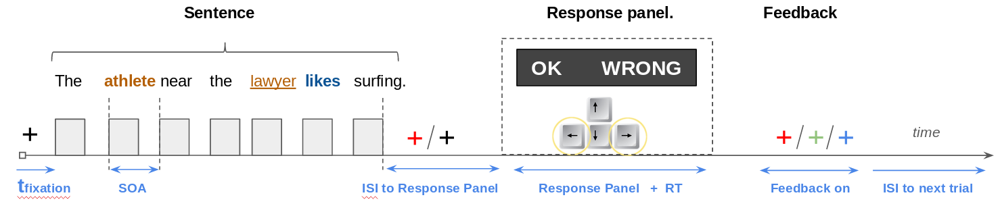

Language local-global experiment.
=================================

:copyright:Unicog, NeuroSpin, Paris, France, 2k19.
--------------------------------------------------------------------------
#####  Authors: Christos Nikolaos Zacharopoulos, Yair Lakretz, Stanislas Dehaene.
###### :email: christonik@gmail.com

### Paradigm description

The subjects are presented with sentences in an Rapid Serial Visual
Presentation (RSVP) manner. Each word is presented sequentially on the
screen. At the end of sentence the participants have to state whether
the sentence that they just saw was correct or not.

-   **What is considered correct?**
    :
       
       A sentence can be correct or wrong in two distinct respects,
        *SYNTAX* **and** *SEMANTICS*. :bangbang: 	__*It is important that
        the experimenter stresses that from the beginning of the experiment.*__
        
       A sentence can be incorrect semantically but perfectly valid
        syntactically. This would be a __*wrong sentence*__ 
        (e.g: The car likes ice-cream) :x:. 
        
       The same goes for sentences that contain a
        syntactic error, but nevertheless, make sense 
        (e.g: The kid like ice-cream) :x:.
        
       Whereas, the following sentence is correct:
       The kid likes ice-cream :heavy_check_mark:. 

-   **How do the subjects respond?**
    :  
     
     At the end of each sentence, the words *'OK'* and *'Wrong'* appear
        on the screen. The words will **not** always appear on the same
        position. In some cases the word *'OK'* will appear on the left,
        while in others on the right. The position of the words is
        pseudo-random. :bangbang: __*It is important that
        the experimenter stresses that
        from the beginning of the experiment.*__ 
        
     The subjects respond by pressing the key-strokes **a** and **l** on a typical 'QWERTY'
        keyboard. Please instruct the subjects to keep their
        **index-fingers only** in the keystrokes at all times, and only
        press the buttons when the words 'OK' and 'Wrong' appear on the
        screen. Please instruct the subjects to respond
        as quickly as possible. While replying, the palms should be
        supinated facing the desk, and only the index-fingers should be
        pronated to avoid false button presses.

-   **What is the overall structure of the experiment?**
    :   
    
     The experiment consists of multiple runs (or blocks - default
        \#:10). Each run consists of 48 trials. The words appear on the
        screen in a successive manner. After the sentence is completed,
        the decision screen appears on the screen and the subjects need
        to reply.

    -   __*Is there online feedback?*__
            :   
            
           Yes. If the subjects respond correctly, the fixation
                cross that follows the decision screen becomes green. If
                they reply incorrectly, the cross becomes red whereas if
                they don't provide with a reply, the cross becomes blue.

    -   __*Is there training for the subjects?*__
            :   
            Yes. The researcher has the option to include some
                training trials prior to the beginning of the
                experiment. It is not necessary to record neural
                activity during the training. Between the runs the
                subject can rest for as much it is necessary, but with
                minimal movement.

-   **What are the specific timings of paradigm?**

```Matlab
       Fixation time:  600 [ms]
       Word On:        250 [ms]
       Word Off:       250 [ms]
       SOA:            500 [ms]
       ISI to response screen ('OK'-'Wrong'): 500 [ms]
       Maximum allowed RT:  1500 [ms]
       ISI to next trial: 1000 [ms]
```


### Installation

The code to run the experiment is standalone. To run the paradigm,
extract the zipped file to the desired location. The base directory
should be very similar to that shown below.
```bash
    .
    ├── Behavioral
    │   └── MEG
    │       ├── subj_00
    │       ├── subj_01
    │       ├── subj_02
    │       ├── subj_03
    │       ├── subj_04
    │       └── subj_05
    ├── Code
    │   └── functions
    ├── Logs
    └── Stimuli
        └── visual
            ├── iEEG
            └── MEG
```


### Code

The paradigm presentation scripts are written in MATLAB (MathWorks) and
tested in Linux, Mac and Windows stations using the Psychophysics
Toolbox Version 3 - flavor 'beta'. The pipeline includes a wrapper
function that calls all the necessary subroutines. This structure is
evident in the code directory. The wrapper function is the:
```Matlab
runLocalGlobalParadigm
```
and all the subroutines are within the
sub-directory *'functions'*. The pipeline uses relative paths allowing
for a standalone execution.

```bash
    .
    ├── functions
    │   ├── convert_toRR.m
    │   ├── createLogFileLocalGlobalParadigm.m
    │   ├── getParamsLocalGlobalParadigm.m
    │   ├── gettimestamp.m
    │   ├── Initialize_PTB_devices.m
    │   ├── initialize_TTL_hardware.m
    │   ├── load_stimuliLocalGlobal.m
    │   ├── present_intro_slide.m
    │   ├── run_training_block.m
    │   ├── run_visual_block.m
    │   ├── send_trigger.m
    │   └── wait_for_key_press.m
    ├── runLocalGlobalParadigm.m
    └── runLocalGlobalParadigm.m~
```


-   **MODES**
    :   
    There are two available modes currently installed (*debugging
        mode* & *recording mode*). 
    
    In the debugging mode, the
        presentation screen is smaller and located at the bottom up part
        of the monitor. This mode works with predefined input arguments
        (see Pipeline INPUT) and provides feedback for the researcher in
        the MATLAB command window (\#trials, condition, RT etc). This
        mode skips the default PTB synchronization tests.

-   **Pipeline INPUT**
    :   
    
    The pipeline expects manual input (GUI) from the researcher for
        the following arguments:

```Matlab
    1. subject: [String]
    2. session: [String]
    3. training [Binary]
    4. ttl      [Binary]
```

   - *INPUT format*:
            :   The counting of the subjects and sessions **is not**
                zero-based. The .csvs files corresponding to *subj00* and
                *sess00* are only used in the debugging mode.
```Matlab
    1. subject: [String]: Should be provided as a 2-string input (e.g: 01,02,..,20)
    2. session: [String]: Should be provided as a 2-string input (e.g: 01,02,..,20)
```              
              
-   **Pipeline OUTPUT**:
    :
     
    The pipeline outputs two .csv files, stored in the folders
        *"Behavioral"* and *"Logs"*. The output directories are created
        automatically based on the following arguments: Method, Subject,
        Session.

The table **Code/code_table.pdf** found in the child directory summarizes
the functions used in the paradigm along with their I/O relationship.

### For the researcher running the experiment:

-   General guidelines:

    1.   Please instruct the subjects to use the bathroom prior to the beginning of the experiment.
    2.   Please instruct the subjects to stay as still as possible during the execution of each run. The paradigm includes a
         resting period between successive runs.
    3.  :bangbang: Please instruct the subjects to **not press any buttons other
         than the keystrokes 'a' and 'l'** and **only press those
         buttons while the words 'OK' and 'Wrong' appear on the
         screen**.

-   Things to check when you run the experiment **for the first time**:
```Matlab
        1. @runLocalGlobalParadigm: 
            Set the params.location and select the active port (A or B).
        2. @getParamsLocalGlobalParadigm: 
            -1. Set the method (e.g: iEEG). 
            -2. Set the refresh-rate of the monitor.
            -3. Select whether you want the photodiode or not. 
            -4. Select the hardware input (e.g: USB-Serial).
        3. @initialize_TTL_hardware:
            Make a new case for your location and specify the TTL box I/O.
        4. @send_trigger: 
            Make a new case for your location here.
```        
    


-    **Before** the experiment starts:
    :   
    Make sure that the paradigm is running using the main function in the running mode 
    (@func: runLocalGlobalParadigm - line#10).
```Matlab
    %% MODE SELECTION
    %#################################################################
    debug_mode = 0;  
```
-   What should the experimenter do **during** the experiment?
    :   
    :bangbang:  At the end of each run the researcher **must** be saving the recorded data. 
     To continue with the experiment as quickly as possible, the data should be named with the following format:
```Matlab
     run_01_raw 
```    
-   What should the experimenter do **after** the experiment?
    :   
     After the end of the experiment, the output will be located in three distinct locations:
```Matlab
     -1 @Neural-Data output: Device specific. 
     -2 @"/run_experiment/Behavioral/MEG/subj_": Here, you should find a  .csv file with the following format:
                              MEG_subj_01_block_1_session_1. There should be as many .csvs as runs executed.
     -3 @"/run_experiment/Logs": Here, you should find ONE .csv file with the following format:
                               logLocalGlobalParadigm_2019Sep11_171032_Subj_00_sess_1_iEEG.csv 
```            
   :bangbang: Those files are **ESSENTIAL** for the analysis and should not be lost.
   :bangbang: When communicating those files, make sure that they correspond to the DATE/SUBJECT/SESSION of the given 
   subject.   

-   What happens if there need to be multiple sessions?
    :
       Unfortunately, this requires manual alteration of the .csv files found in: 
```bash
    /run_experiment/Stimuli/visual/METHOD/subj_
```
   :bangbang: The stimuli .csv files contain **ZERO-BASED** indexing.
        
        1.   Check how many runs were recorded in the previous session (e.g runs 1:6).
        2.   Move the corresponding .csv to another folder. :bangbang: (corresponds to blocks 0:5)
        3.   Reset the index of the remaining files. (e.g subj_20_iEEG_b_6_.csv --> subj_20_iEEG_b_1_.csv) 


